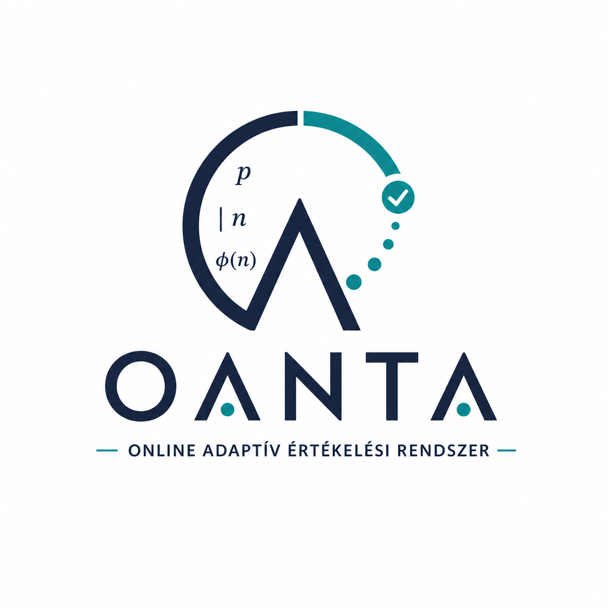

# OANTA – Online Adaptív Számelméleti Értékelő Rendszer

Korszerű, **IRT-alapú adaptív tesztelési platform** középiskolásoknak. 
A rendszer a tanuló egyéni tudásszintjéhez igazodva méri a számelméleti gondolkodást, 
és azonnali, személyre szabott visszajelzést nyújt.

## ✨ Funkciók

- 🎯 **Adaptív tesztelés** – 3PL IRT modell, MAP képességbecslés, Fisher-információ
- 💡 **3 szintű segítség** – orientáló, stratégiai és eljárás-specifikus hintek
- 📊 **Tanári műszerfal** – tévképzet-hőtérkép, statisztikák, korrelációvizsgálat
- 🏆 **Gamifikáció** – XP, 10 szint, Prímvadászat és Párosító memória játék
- 📱 **Reszponzív design** – mobilon, tableten és gépen is működik
- 🌙 **Sötét mód** – kíméli a szemet
- 📥 **CSV importálás** – tanulók és feladatok egyszerű betöltése
- 📝 **PDF riportok** – személyre szabott szöveges értékeléssel
- 🔒 **Biztonság** – CAPTCHA védelem, jelszó visszaállítás emailben

## 🛠 Technológia

| Komponens | Technológia |
| :--- | :--- |
| Frontend | HTML5, CSS3, JavaScript (vanilla) |
| Backend | PHP 8, MySQL/MariaDB |
| Könyvtárak | Chart.js, Plotly.js |
| Pszichometria | IRT 3PL modell, MAP becslés |
| Email | PHPMailer – jelszó visszaállítás |

## 📊 Feladatbank

- **150+ feladat** 6 számelméleti témakörben
- Típusok: feleletválasztós (MC), numerikus (NUM)
- Nehézségi szintek: Könnyű, Közepes, Nehéz
- IRT paraméterek: a (diszkrimináció), b (nehézség), c (tippelés)

## 🔗 Link

👉 [https://negyesipeter.hu/oanta/](https://negyesipeter.hu/oanta/)

## 👤 Szerző

**Dr. Négyesi Péter** – matematika-digitális kultúra szakos tanár

## 📄 Licenc

MIT License – Lásd a [LICENSE](LICENSE) fájlt.

---

© 2026 Dr. Négyesi Péter. Minden jog fenntartva.
